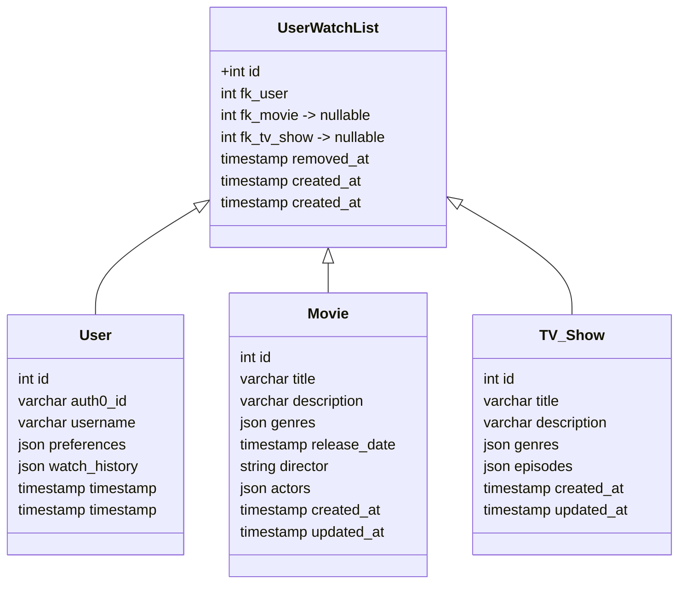

# Bootstrap project for Stage backend development with Node JS and TypeScript

# System Requirement

```
1. Node version defined in package.json engines
2. Tool to manage MySql, such as TablePlus
```

# DB Setup

```
1. Create a mysql connection in TablePlus using the credentials given in config/index.ts file
```

# Installation

```
npm install
```

# Sample data setup

```
npm run migrate:dev
```

# Start the Dev server

```
npm run dev
```

# About project

```
It contains 3 user facing APIs which are following:-
1. addContentInUserWatchlist
2. getUserWatchlist
3. removeContentFromUserWatchList

The feature is build using following tech stack:-
Languages: Javascript and TypeScript
Database: MySQL
Framework: Node.js, hapi.js
```

# About Feature

```
We have made four tables for the feature which are following:-
1. user:- For saving user's info
2. movie:- For saving movie's info
3. tv_show:- For saving tv_show info
4. user_watch_list:- For saving user WatchList info

```



```
Listing down the implementation of three APIs, also attaching there curls

1. Add to My List - add a movie or TV show to the user's list. Each item can be identified by a unique ID, and the user's list should not contain duplicates.

Request Endpoint - POST /users/add/content/watch-list

Request Payload -
{
  "contentType": "movie", // "tv_show" can also be a valid value
  "contentId": 1 // id of the respective table `movie` or `tv_show`
}

Api business logic steps:-
1. Validate request payload
2. Check if user exist in db or not, if not api will return `UnauthorizedError`.
3. Else Check if content exist in the respective tables(movie | tv_show) on the basis of contentType and contentId,
   if content doesn't exist api will return `ContentNotFoundError`.
4. Else Fetch data from `user_watch_list` table with the query (column selection will be dynamic on the basis of   contentType) -> select * from user_watch_list where fk_user = userId and fk_movie | fk_tv_show = contentId.
5. Query will return an array of user_watch_list, Find if there is an item with field removedAt as NULL,
if found which means the content already exists in `user_watch_list`, return `ContentAlreadyExistsInUserWatchList`.
6. Else create an entry in `user_watch_list` table.

Sample response of the api:-

Status Code - 200
{
    "result": true,
    "data": {
        "id": 2
    }
}

Sample Error response of the api:-
1. Status Code - 401
{
    "result": false,
    "error": {
        "code": "Unauthorized",
        "message": "Unauthorized",
        "statusCode": 401
    }
}

2. Status Code - 404
{
    "result": false,
    "error": {
        "code": "ContentNotFoundError",
        "message": "Content with contentType: [tv_show] not found with id: [99]",
        "statusCode": 404
    }
}

3. Status Code - 400
{
    "result": false,
    "error": {
        "code": "ContentAlreadyExistsInUserWatchList",
        "message": "Content with contentType: [tv_show] and id: [1] already exist in user's watch list.",
        "statusCode": 400
    }
}


Attaching the curl below->

curl --location --request POST 'http://0.0.0.0:3000/api/users/add/content/watch-list' \
--header 'x-user-id: ka51ZYFZ8xiBAMuBSdUdu' \
--header 'Content-Type: application/json' \
--data-raw '{
    "contentType": "tv_show",
    "contentId": 1
}'
=============================================================================
2. Remove from My List - remove an item from the user's list using the item's unique ID.

Request Endpoint - DELETE /users/watchlist/{contentId}

Request Params -
{
  "contentId": 1 // id of the `user_watch_list` table
}

Api business logic steps:-
1. Validate request params.
2. Check if user exist in db or not, if not api will return `UnauthorizedError`.
3. Else Check if content exist in `user_watch_list` table with contentId, if not api will return `UserWatchlistNotFoundError`.
4. if data exist in  `user_watch_list` table and removed_at has value then api will return `UserWatchlistNotFoundError`.
5. Else if data.fk_user!= session user then api will return `ContentNotFoundInUserWatchlistError`.
6. Else update the removed_at field with current timestamp.

Sample response of the api:-

Status Code - 200
{
    "result": true,
    "data": {}
}

Sample Error response of the api:-

1. Status Code - 401
{
    "result": false,
    "error": {
        "code": "Unauthorized",
        "message": "Unauthorized",
        "statusCode": 401
    }
}

2. Status Code - 404
{
    "result": false,
    "error": {
        "code": "UserWatchlistNotFoundError",
        "message": "User watch list not found with id: [4]",
        "statusCode": 404
    }
}

3. Status Code - 404
{
    "result": false,
    "error": {
        "code": "ContentNotFoundInUserWatchlistError",
        "message": "Content not found in user Watchlist with id: [2]",
        "statusCode": 404
    }
}


Attaching the curl below->

curl --location --request DELETE 'http://0.0.0.0:3000/api/users/watchlist/2' \
--header 'Content-Type: application/json' \
--header 'x-user-id: kjhefiuhoeuidfipoajdd'

=============================================================================

3. List My Items - retrieve all items in the user's list. The response should be paginated to handle potentially large lists efficiently.

Request Endpoint - GET /users/watchlist

Request Query -
{
  "page": 0,
  "limit": 10
}


Api business logic steps:-
1. Validate request query params.
2. Check if user exist in db or not, if not api will return `UnauthorizedError`.
3. Else fetch the data with the following query -> select * from user_watch_list where fk_user = 1 and removed_at IS NULL;

Sample response of the api:-

Status Code - 200
{
    "result": true,
    "data": {
        "results": [
            {
                "id": 2,
                "fkUser": 1,
                "fkMovie": null,
                "fkTvShow": 1,
                "removedAt": null,
                "createdAt": "2024-06-02T15:44:03.000Z",
                "updatedAt": "2024-06-03T06:26:15.000Z"
            }
        ],
        "total": 1,
        "size": 10,
        "page": 0,
        "nbPages": 1
    }
}

Sample Error response of the api:-
1. Status Code - 401
{
    "result": false,
    "error": {
        "code": "Unauthorized",
        "message": "Unauthorized",
        "statusCode": 401
    }
}


Attaching the curl below->

curl --location --request GET 'http://0.0.0.0:3000/api/users/watchlist' \
--header 'Content-Type: application/json' \
--header 'x-user-id: ka51ZYFZ8xiBAMuBSdUdu' \
--data-raw '{
    "contentType": "tv_show",
    "contentId": 1
}'

```
